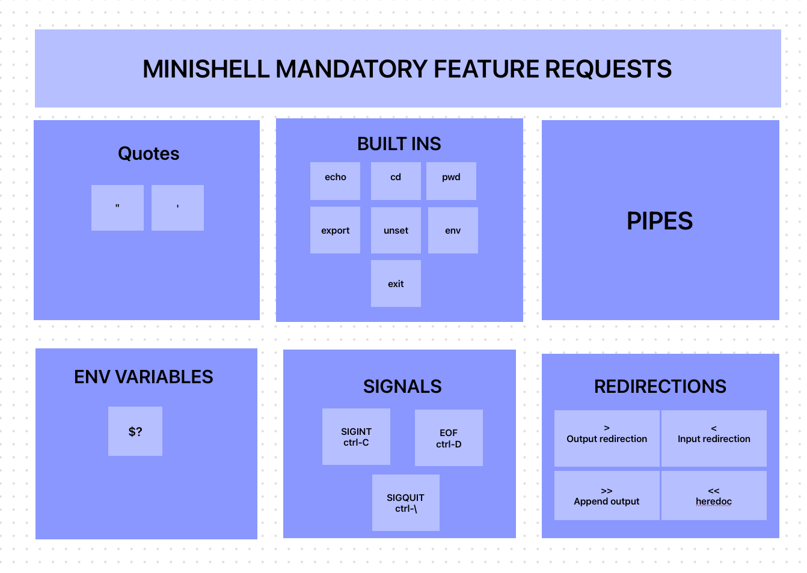
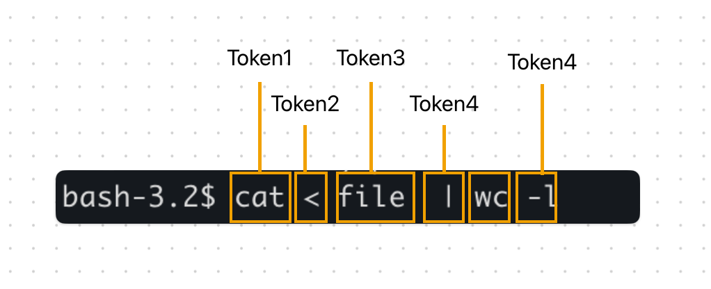
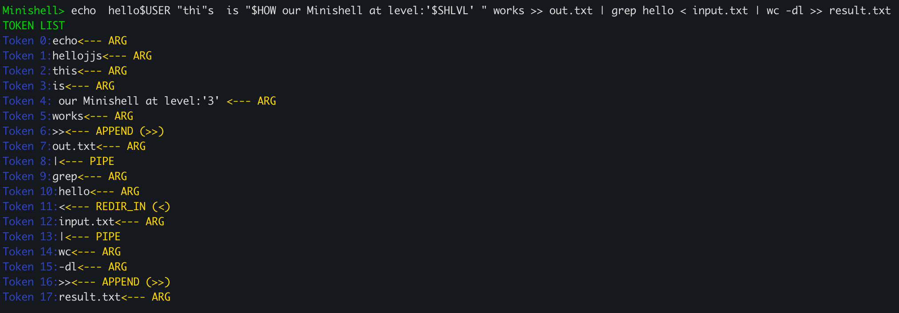
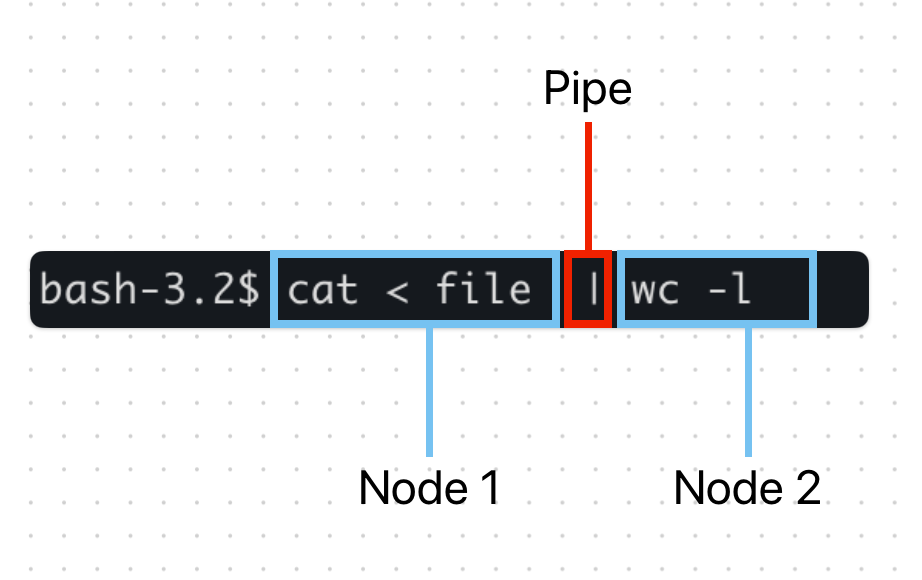
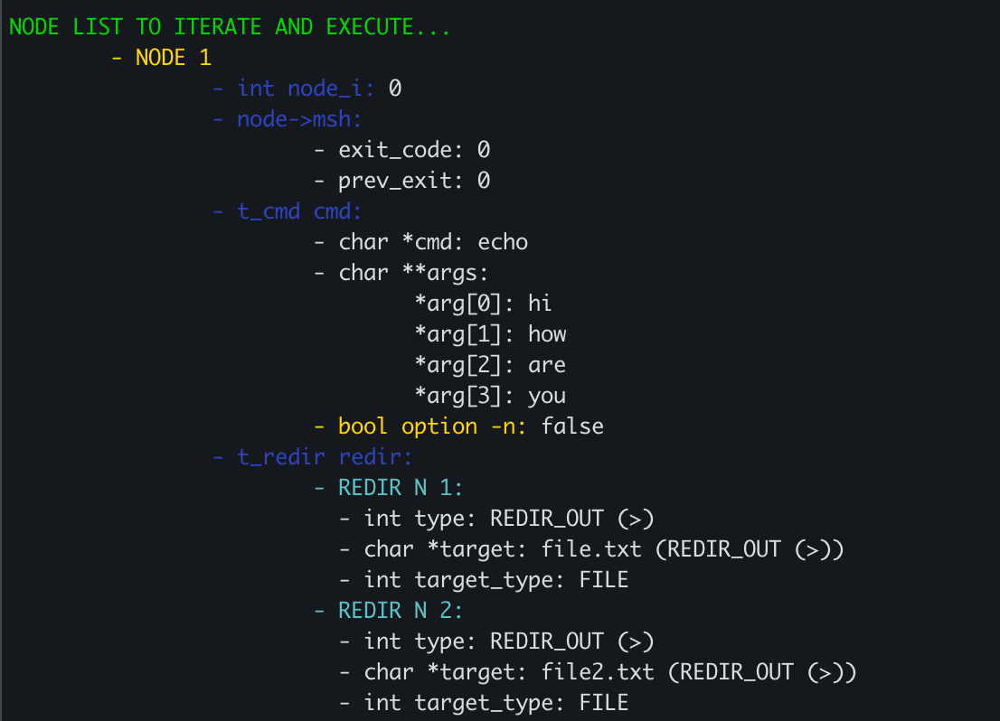
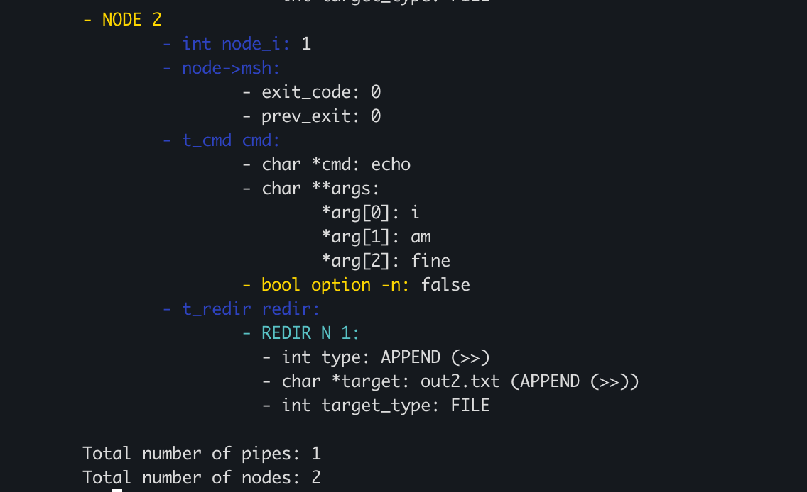

# Minishell

Minishell is a command-line interpreter that mimics the behavior of popular UNIX shells like bash.


It is a project built in C as a part of the 42 Berlin curriculum.
At 42, assignments are typically presented as requests to build projects that meet specific technical requirements without providing further instructions or external resources to the student. This approach is intentional: the school emphasizes preparing students from day one to tackle challenges just as they would need to do in a real-world work environment.
Students are expected to independently research, experiment, and debug in order to deliver functional, well-structured solutions that will then be evaluated at school.
In many cases, the specifications are also deliberately vague, encouraging deeper analysis, problem-solving, and realistic decision-making under uncertainty.
More about the project requirements can be read [here](./minishell_requirements.pdf).

# Resources used



-   [Bash Manual](https://www.gnu.org/software/bash/manual/bash.html)
-   [Shell & Utilities by Open Group](https://pubs.opengroup.org/onlinepubs/9699919799/utilities/contents.html)
-   [Unix Processes in C](https://www.youtube.com/playlist?list=PLfqABt5AS4FkW5mOn2Tn9ZZLLDwA3kZUY)
-   [Shell progem explained](https://www.youtube.com/watch?v=ubt-UjcQUYg)

# Parser

The parser is the first stage in the Minishell program. Its job is to take the raw user input, interpret it, and transform it into a linked list of command nodes that the executor can then trasverse and execute.
Each node represents a single command along with its arguments, options, redirections and other metadata.

**To prepare this structure, the parser acts in 2 main steps:**

## 1. **Tokenization**:

The tokenization process is the first parsing step, responsible for scanning the raw input string and producing a linked list of tokens, each annotated with its type. This prepares the input for syntactic analysis in the node construction step.


### How it works:

The main entry point is:

```
t_tokens *return_tokens(char *input, t_msh *msh);
```

This function processes the input string character by character, generating tokens based on syntactic and semantic rules.
Each token is represented as the following:

```
typedef enum e_token_type {
	REDIR_IN,   // <
	REDIR_OUT,  // >
	APPEND,     // >>
	HEREDOC,    // <<
	PIPE,       // |
	ARG         // command name, argument, or filename
} t_token_type;

typedef struct s_tokens {
	char *value;
	t_token_type type;
	struct s_tokens *next;
} t_tokens;
```

The tokenizer processes the input character by character, building a list of tokens. Its logic is designed to identify and classify elements of the shell syntax in a single pass.

-   Whitespace characters are used as a delimiter between tokens, they skipped and not stored (unless it is part of a quoted string).

-   The tokenizer pays special attention to metacharacters like `>`, `<`, `>>`, `<<`, and `|`, which are always treated as separate tokens with specific types (`REDIR_IN`, `REDIR_OUT`, `APPEND`, `HEREDOC`, `PIPE`).

-   Anything else that is not whitespace and not a metacharacter is grouped into an `ARG` token.
    This includes command names, filenames, options and any other meta characters besides the ones mentioned above (the project is called Minishell for a reason, it does not implement all shell features).
    During the `ARG` scan:

    Quotes (`'`, `"`) are immediately processed as one single `ARG` token, even if it contains whitespaces or special characters. An odd number of quotes will result in an error, as the parser expects them to be balanced.

    Environment variables are also already handled at this stage, so if the input contains `$VAR` or `$?`, they are replaced with their values from the environment or shell state, unless they are inside single quotes.

For a a more detailed overview on how our tokenizer works, you can uncomment the code at line 42 in `srcs/parser/main.c`:

```
print_tokens(tokens);
```

When the following line is uncommented and Minishell is recompiled and executed, the resulting token list from the input string will be printed, as illustrated below:


## 2. **Node Construction**:

In this step, the parser transforms the flat list of tokens into a structured syntax tree, implemented as a linked list of command nodes. Each node represents a command with its arguments, redirections and other metadata.
The parser also validates the order of each token type, ensuring that it adheres to the expected structure (e.g. no consecutive pipes or redirections, no pipes or redirections as first or last tokens in the list).

### How it works:

The main entry point is:

```
t_node_list	*return_nodes(t_tokens *token, t_msh *msh)
```

This function traverses the list of t_tokens produced by the tokenizer and groups them into logical command segments.



**A new node is created every time a pipe (`|`) is encountered, representing a separate command in the pipeline.**

Within each node, tokens are distributed into specific components:

```
typedef struct s_node_list
{
	t_msh *msh;
	struct s_node_list *prev;
	t_cmd *cmd;
	t_redir *redir;
	int node_i;
	int nodes_total;
	int fd_in;	// stefano added, could have been part of redir struct from my pov
	int fd_out; // stefano added, could have been part of redir struct from my pov
	struct s_node_list *next;
} t_node_list;
```

Each component has its own distinct role:

1.  **Command struct (`t_cmd`):**

    ```
    typedef struct s_cmd
    {
    	char *cmd;
    	char **args;
    	bool option_n;
    } t_cmd;
    ```

    The command structure holds the actual name of the executable (e.g., ls, grep, echo) and its arguments. It is designed with the following elements:

-   The command (`char *cmd`):

    The command is stored as a string and represents the name of the executable or built-in command to be run. It is the first `ARG` token in each command node, and it can be a simple command like `ls`, `echo`, or a path to an executable.

-   Arguments (`char **args`):

    Arguments are stored as a char\*\* array and include all command-line parameters passed to the command. This includes flags like -l, positional arguments like filename.txt, or expanded variables. These are collected in order, preserving quoting and spacing semantics as parsed in the tokenization stage.

-   Echo's `-n` flag (`bool option_n`):

    The `-n` flag is a special case for the `echo` command which we are requested to code ourselves.
    It is used to control whether the output should end with a newline character or not.
    It is handled as a boolean flag in the `t_cmd` structure, which is set to true if the `-n` flag is present in the arguments.
    It also handle edge cases like `echo -n -n` or `echo hello -n` and more.

2.  Redirections (`t_redir`):

```
typedef struct s_redir
{
	struct s_redir *prev;
	int type;
	int redir_i;
	char *target;
	int fd;
	struct s_redir *next;
} t_redir;
```

Since the there can be multiple redirections in a single command node, they are stored in a double list of `t_redir` structures. Each of which contains:

-   `int type`: An integer representing the type of redirection (e.g., `<`, `>`, `>>`, `<<`). This is used to determine how the file descriptors should be set up for the command execution.
-   `int redir_i`: An index to track the position of the redirection in the command node, which is useful for debugging and error reporting.
-   `chat *target`: A string representing the target of the redirection, such as a filename for file redirections or a delimiter for heredocs.
-   `int fd`: The file descriptor associated with the redirection, which is set up during the execution phase. This allows the shell to redirect input or output streams as specified by the user.

3.  Shared Shell Context (Process-Oriented Subset `t_msh `):

    The t_msh struct holds essential runtime state shared across all nodes during parsing and execution. It enables coordination between components without relying on globals.

    -   `char \*\*ms_env`:
        current environment passed to child processes via execve.
    -   `int exit_code`:
        exit status of the current executed command.
    -   `int prev_exit`:
        stored exit code from the previously executed input (which enables correct exit code printing when calling `echo $?`).

4.  Node-level metadata used to facilitate parsing and execution and respect formatting rules requested by the school.

This structure enables each node to be self-contained and fully descriptive, making it possible to set up file descriptors and process state before forking and executing the command.

For a a more detailed overview on how our tokenizer works, you can uncomment the code at line 75 in `srcs/parser/main.c`:

```
print_nodes(nodes);
```

When the following line is uncommented and Minishell is recompiled and executed, the resulting syntax tree from the input string will be printed, as illustrated below:

```
Minishell> echo hi > file.txt how are >file2.txt you  | >> out2.txt echo i am fine
```




# Execution

The execution phase is responsible for taking the structured command nodes produced by the parser and actually running the commands, handling all the complexities of UNIX process management, redirections, and builtins.

What Execution Handles

-   **Built-in Commands**: Executes shell builtins (cd, echo, env, exit, export, pwd, unset) directly in the shell process, ensuring correct environment and state management.
-   **External Commands**: Locates and runs external binaries using the PATH environment variable, forking child processes as needed.
-   **Pipelines**: Sets up pipes between commands in a pipeline, ensuring correct data flow from one process to the next.
-   **Redirections**: Handles all standard redirections (>, >>, <, <<), including robust heredoc support with variable expansion and signal handling.
-   **Signal Handling**: Manages signals (SIGINT, SIGQUIT) both in the shell and in child processes, ensuring correct interactive behavior and cleanup.
-   **Exit Codes**: Propagates and updates exit codes according to UNIX conventions, including special handling for signals and errors.
-   **Resource Management**: Cleans up all allocated memory, file descriptors, and process resources, even in the presence of errors or signals.

# Compilation

To compile Minishell, simply run:

```sh
make
```

This will produce the `minishell` executable in the project directory.

# Running Minishell

To start the shell, run:

```sh
./minishell
```

# Checking the Project

You can check the project by running various shell commands and builtins, as described above. Make sure to test with different combinations of pipes, redirections, and quoting.

# Memory Leaks

Minishell is designed to be leak-free. You can verify this using [Valgrind](https://valgrind.org/):

```sh
valgrind --leak-check=full --show-leak-kinds=all ./minishell
```

This will report any memory leaks or invalid memory usage. If you see "All heap blocks were freed -- no leaks are possible", the shell is leak-free.
